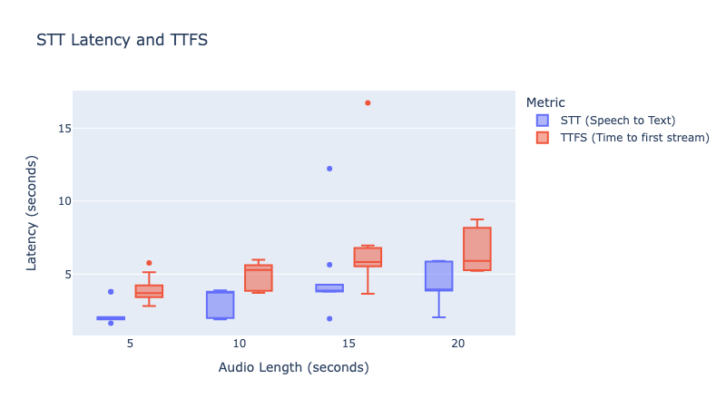

# Building a Fast Speech-to-Text + LLM Pipeline: Achieving Sub-5 Second Responses from Audio Input on a Raspberry Pi 5.



In this tutorial, we'll explore how to build a lightning-fast pipeline that combines Speech-to-Text (STT) and Large Language Model (LLM) capabilities. We'll use a Python implementation that achieves end-to-end **response times under 5 seconds** on a Raspberry Pi 5 module with **No GPU / TPU / NPU Units** & **8GB RAM**, making it suitable for real-time edge applications.

## Overview

The system we'll build has two main components:
1. A Speech-to-Text service (using whisper.cpp)
2. A Large Language Model service (using llama.cpp)

Both services run as separate processes and communicate via HTTP, allowing for efficient parallel processing and resource utilization.

## Prerequisites

You'll need:
- Python 3.7+
- whisper.cpp compiled with your model of choice
- llama.cpp compiled with your preferred LLM
- Required Python packages: `dataclasses`, `pyyaml`, `requests`

## Core Components

### Environment Configuration

The system uses a hierarchical configuration system with three main classes:

```python
@dataclass
class STTEnvironmentConfig(EnvironmentConfig):
    port: int = 8080
    _warmup: int = 5
    # Configuration for whisper.cpp

@dataclass
class LLMEnvironmentConfig(EnvironmentConfig):
    batch_size: int = 8192
    ubatch_size: int = 512
    stream: bool = True
    port: int = 8081
    _warmup: int = 15
    # Configuration for llama.cpp

@dataclass
class EngineEnvironmentConfig:
    stt: STTEnvironmentConfig
    llm: LLMEnvironmentConfig
    log_path: str = "environment.log"
```

### The Engine Class

The `Engine` class is the heart of our system. It manages both STT and LLM processes and handles the communication between them:

```python
class Engine:
    def __init__(self, config: EngineEnvironmentConfig):
        self.config = config
        self.init_handlers()
        
    def call(self, input: STTInput) -> EngineResponse:
        # Process audio input and generate response
        tick = time.time()
        stt_response = STTResponse.from_response(call_stt_environment(input))
        stt_latency = time.time()
        
        llm_input = LLMInput.from_stt_response(self.config.llm, stt_response)
        # Handle streaming response...
```

## Implementation Guide

### 1. Create Configuration

First, create a YAML configuration file:

```yaml
stt:
  n_threads: 4
  n_procs: 1
  flash_attn: true
  gpu: true
  port: 8080
  model: "/path/to/whisper/model"
  _executable: "/path/to/whisper.cpp/server"

llm:
  n_threads: 4
  n_procs: 1
  flash_attn: true
  gpu: true
  port: 8081
  model: "/path/to/llm/model"
  _executable: "/path/to/llama.cpp/llama-server"
  batch_size: 8192
  ubatch_size: 512
  stream: true
```

### 2. Initialize the Engine

```python
config = EngineEnvironmentConfig.from_yaml("config.yaml")
engine = Engine(config)
```

### 3. Process Audio Input

```python
input_audio = STTInput(
    environment_config=engine.config.stt,
    audio_path="path/to/audio.wav"
)

response = engine.call(input_audio)
```

## Performance Optimization Techniques

To achieve sub-5 second response times, the implementation uses several optimization strategies:

1. **Parallel Processing**: Both STT and LLM services run as separate processes
2. **Streaming Responses**: LLM responses are streamed for faster Time To First Token (TTFS)
3. **Thread Management**: Dedicated threads for stream decoding and processing
4. **Efficient Resource Usage**: Configurable thread and process counts for both services

### Stream Processing Implementation

The system uses queues and threading for efficient stream processing:

```python
decoded_streams = queue.Queue()
stream_queue = queue.Queue()
stop_event = threading.Event()

decode_thread = threading.Thread(
    target=decode_stream,
    args=(stop_event, stream_queue, decoded_streams, True)
)
decode_thread.start()
```

## Performance Metrics

The implementation tracks several key performance metrics:

- Total latency (end-to-end response time)
- STT latency
- Time To First Token (TTFS)
- Stream processing time

These metrics are included in the `EngineResponse`:

```python
@dataclass
class EngineResponse:
    stt_response: Optional[STTResponse]
    llm_response: Optional[LLMResponse]
    latency: float
    stt_latency: float
```

## Best Practices and Tips

1. **Warm-up Period**: Both services have configurable warm-up periods to ensure stable performance
2. **Resource Management**: Always terminate processes properly:
   ```python
   try:
       engine = Engine(config)
       response = engine.call(input_audio)
   finally:
       engine.terminate()
   ```

3. **Error Handling**: The implementation includes comprehensive error handling and logging
4. **Configuration Optimization**:
   - Adjust `batch_size` and `ubatch_size` based on your hardware
   - Use `flash_attn` when available for better performance
   - Configure thread counts based on your CPU capabilities

## Complete Usage Example

Here's a complete example putting it all together:

```python
from pathlib import Path

# Load configuration
config = EngineEnvironmentConfig.from_yaml("config.yaml")

# Initialize engine
engine = Engine(config)

try:
    # Process audio
    input_audio = STTInput(
        environment_config=engine.config.stt,
        audio_path=Path("input.wav")
    )
    
    response = engine.call(input_audio)
    
    # Print results
    print(f"Speech-to-Text: {response.stt_response.text}")
    print(f"LLM Response: {response.llm_response.text}")
    print(f"Total Latency: {response.latency:.2f}s")
    print(f"STT Latency: {response.stt_latency:.2f}s")
    print(f"Time to First Token: {response.llm_response.ttfs:.2f}s")

finally:
    # Clean up
    engine.terminate()
```


## Performance Data

For [recipe/rpi5.yaml](recipe/rpi5.yaml) (configuration for Raspberry Pi 5), the following performance data was collected:


| audio_length | ('latency', 'count') | ('latency', 'mean') | ('latency', 'std') | ('latency', 'min') | ('latency', '25%') | ('latency', '50%') | ('latency', '75%') | ('latency', 'max') | ('ttfs', 'count') | ('ttfs', 'mean') | ('ttfs', 'std') | ('ttfs', 'min') | ('ttfs', '25%') | ('ttfs', '50%') | ('ttfs', '75%') | ('ttfs', 'max') | ('stt_latency', 'count') | ('stt_latency', 'mean') | ('stt_latency', 'std') | ('stt_latency', 'min') | ('stt_latency', '25%') | ('stt_latency', '50%') | ('stt_latency', '75%') | ('stt_latency', 'max') | ('true_audio_length', 'count') | ('true_audio_length', 'mean') | ('true_audio_length', 'std') | ('true_audio_length', 'min') | ('true_audio_length', '25%') | ('true_audio_length', '50%') | ('true_audio_length', '75%') | ('true_audio_length', 'max') |
|---------------:|-----------------------:|----------------------:|---------------------:|---------------------:|---------------------:|---------------------:|---------------------:|---------------------:|--------------------:|-------------------:|------------------:|------------------:|------------------:|------------------:|------------------:|------------------:|---------------------------:|--------------------------:|-------------------------:|-------------------------:|-------------------------:|-------------------------:|-------------------------:|-------------------------:|---------------------------------:|--------------------------------:|-------------------------------:|-------------------------------:|-------------------------------:|-------------------------------:|-------------------------------:|-------------------------------:|
|              5 |                     10 |               59.25   |             1.22082  |              56.4676 |              59.1167 |              59.2976 |              59.5583 |              61.0865 |                  10 |            3.92235 |          0.908844 |           2.80697 |           3.44062 |           3.69433 |           4.13979 |           5.75959 |                         10 |                   2.2875  |                 0.799173 |                  1.63432 |                  1.9056  |                  1.91702 |                  2.05574 |                  3.78829 |                               10 |                          5.3868 |                       0.390136 |                          4.704 |                          5.175 |                          5.292 |                          5.712 |                          5.976 |
|             10 |                     10 |               60.152  |             0.961372 |              58.6967 |              59.2795 |              60.5673 |              60.7775 |              61.3416 |                  10 |            4.93443 |          0.869188 |           3.72148 |           4.07841 |           5.28368 |           5.58236 |           5.9763  |                         10 |                   3.10775 |                 0.899781 |                  1.89324 |                  2.10296 |                  3.74826 |                  3.79062 |                  3.88297 |                               10 |                          9.4956 |                       0.37842  |                          9     |                          9.195 |                          9.474 |                          9.819 |                         10.008 |
|             15 |                     10 |               61.8439 |             3.67595  |              58.673  |              60.5417 |              60.8169 |              61.7151 |              71.9539 |                  10 |            6.80633 |          3.60404  |           3.65703 |           5.539   |           5.83373 |           6.61217 |          16.7264  |                         10 |                   4.72028 |                 2.77814  |                  1.95187 |                  3.80785 |                  3.86919 |                  4.19178 |                 12.2173  |                               10 |                         14.7996 |                       0.650957 |                         14.004 |                         14.376 |                         14.592 |                         15.27  |                         15.816 |
|             20 |                      7 |               61.6978 |             1.64498  |              60.2291 |              60.2595 |              60.915  |              63.1361 |              63.9491 |                   7 |            6.65838 |          1.57408  |           5.21642 |           5.28956 |           5.90789 |           8.0795  |           8.74626 |                          7 |                   4.47585 |                 1.45102  |                  2.03812 |                  3.88672 |                  3.95315 |                  5.83009 |                  5.90609 |                                7 |                         20.3143 |                       0.623054 |                         19.224 |                         19.968 |                         20.52  |                         20.784 |                         20.952 |


Note: The data was collected using the [performance.py](performance.py) script over a small sample of audio files of different lengths, collected from `mozilla-foundation/common_voice_13_0`.

## Conclusion

This implementation provides a robust foundation for building fast, efficient speech-to-text and LLM applications. By leveraging parallel processing, streaming responses, and careful resource management, we can achieve consistent sub-5 second response times for end-to-end audio processing and LLM interaction.

The modular design allows for easy customization and extension, while the comprehensive configuration system enables fine-tuning for different hardware setups and performance requirements.
