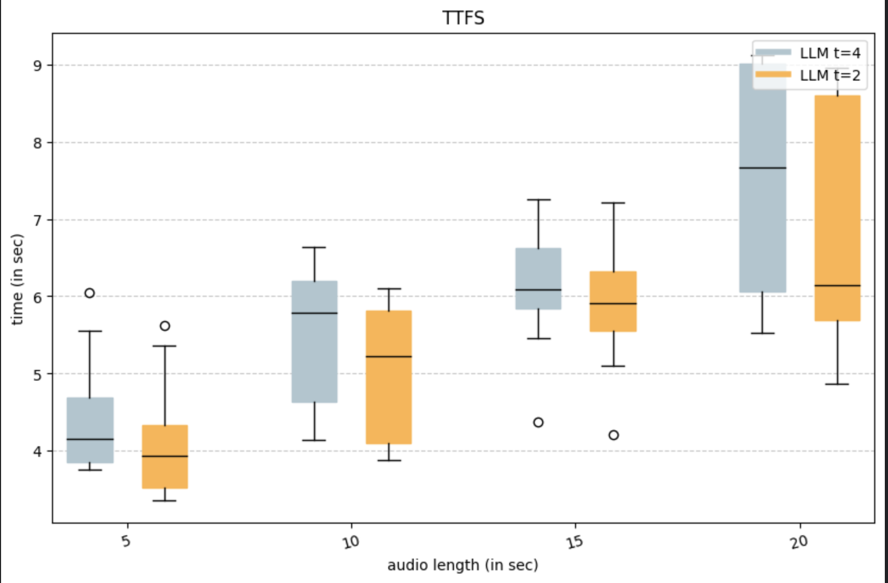

# The speed evals for text-to-speech engine on Raspberry Pi 5

Above diagram shows Time to First Text Stream coming from the LLM

Abiove diagram shows Time to First Audio stream coming from the TTS engine.